# Database diagram

**Generated** 7 September 2026 · Companion to [`DATABASE_TABLES_REPORT.md`](DATABASE_TABLES_REPORT.md) and [`docs/SCHEMA_FROM_CODE.sql`](docs/SCHEMA_FROM_CODE.sql).

35 tables, 55 relationships. Everything here is derived from the 25 `.sql` files and the application's CRUD call sites — no documentation was used.

## How to read these diagrams

| Notation | Meaning |
|---|---|
| `A ||--o{ B` **solid line** | **Confirmed foreign key.** A `REFERENCES` clause exists in a `.sql` file. 16 of these. |
| `A ||..o{ B` **dashed line** | **Inferred relationship.** A `{table}_id` column exists and a table of that name exists — but no `REFERENCES` clause proves the constraint. 39 of these. |
| `PK` / `FK` | Primary / foreign key |
| `"confirmed"` | Column and type verbatim from `CREATE`/`ALTER TABLE` |
| `"inferred"` | Column name proven by a query; type inferred from naming |
| `"inferred-single"` | As above, and only one call site touches it |

> **A dashed line is a hypothesis, not a constraint.** The database may enforce it, may enforce it differently, or may not enforce it at all — application code cannot tell you. Only the 16 solid lines are established fact.

---

## 1. Overview — structural relationships

Every table also carries ownership columns (`user_id`, `organization_id`, `owner_id`); drawing those here would put 28 edges into `profiles` alone and hide everything else. They have their own section below. What remains are the 18 relationships that describe how the data is actually shaped.

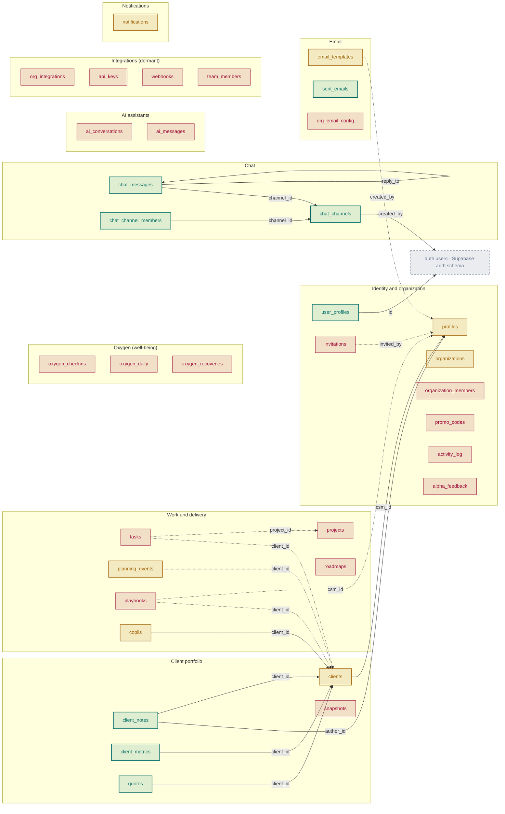

Border colour marks where each table's definition lives: **teal** = `CREATE TABLE` in the repo (8) · **amber** = only `ALTER`s in the repo (7) · **rose** = no SQL at all, reconstructed from code (20) · **grey dashed** = external (Supabase `auth` schema).

---

## 2. Tenancy

The 37 relationships held back from the overview. Almost every table carries an owner, and which owner column it carries determines what a row is scoped to — and therefore what any RLS policy has to key on.

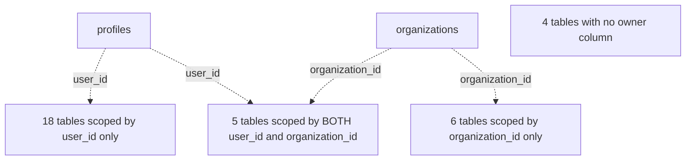

| Scope | Tables |
|---|---|
| `user_id` only | `ai_conversations`, `ai_messages`, `api_keys`, `chat_channel_members`, `clients`, `copils`, `org_integrations`, `oxygen_checkins`, `oxygen_daily`, `oxygen_recoveries`, `playbooks`, `projects`, `roadmaps`, `sent_emails`, `snapshots`, `tasks`, `team_members`, `webhooks` |
| Both | `activity_log`, `chat_messages`, `client_metrics`, `organization_members`, `quotes` |
| `organization_id` only | `chat_channels`, `client_notes`, `email_templates`, `invitations`, `profiles`, `promo_codes` |
| No owner column found | `alpha_feedback`, `notifications`, `planning_events`, `user_profiles` |

> A table with **both** columns can be filtered two ways, and the two do not always agree — this is exactly the split described in `DATABASE_TABLES_REPORT.md` §7.3, where three API endpoints scope by user while the SQL quota trigger scopes by organization. Tables listed as having no owner column may still have one that no code path reads.

---

## 3. Identity and organization

`profiles`, `user_profiles`, `organizations`, `organization_members`, `invitations`, `promo_codes`, `activity_log`, `alpha_feedback`. 1 confirmed relationship, 9 inferred.

```mermaid
erDiagram
    organizations ||..o{ activity_log : "organization_id (inferred)"
    profiles ||..o{ activity_log : "user_id (inferred)"
    profiles ||..o{ ai_conversations : "user_id (inferred)"
    profiles ||..o{ ai_messages : "user_id (inferred)"
    profiles ||..o{ api_keys : "user_id (inferred)"
    organizations ||..o{ chat_channels : "organization_id (inferred)"
    organizations ||..o{ chat_messages : "organization_id (inferred)"
    organizations ||..o{ client_metrics : "organization_id (inferred)"
    profiles ||--o{ client_metrics : "user_id"
    profiles ||--o{ client_notes : "author_id"
    organizations ||..o{ client_notes : "organization_id (inferred)"
    profiles ||--o{ clients : "csm_id"
    profiles ||..o{ clients : "user_id (inferred)"
    profiles ||..o{ copils : "user_id (inferred)"
    profiles ||..o{ email_templates : "created_by (inferred)"
    organizations ||..o{ email_templates : "organization_id (inferred)"
    profiles ||..o{ email_templates : "owner_id (inferred)"
    profiles ||..o{ invitations : "invited_by (inferred)"
    organizations ||..o{ invitations : "organization_id (inferred)"
    profiles ||..o{ org_email_config : "owner_id (inferred)"
    profiles ||..o{ org_integrations : "user_id (inferred)"
    organizations ||..o{ organization_members : "organization_id (inferred)"
    profiles ||..o{ organization_members : "user_id (inferred)"
    profiles ||..o{ organizations : "owner_id (inferred)"
    profiles ||..o{ oxygen_checkins : "user_id (inferred)"
    profiles ||..o{ oxygen_daily : "user_id (inferred)"
    profiles ||..o{ oxygen_recoveries : "user_id (inferred)"
    profiles ||..o{ playbooks : "csm_id (inferred)"
    profiles ||..o{ playbooks : "user_id (inferred)"
    organizations ||..o{ profiles : "organization_id (inferred)"
    profiles ||..o{ projects : "user_id (inferred)"
    organizations ||..o{ promo_codes : "organization_id (inferred)"
    organizations ||..o{ quotes : "organization_id (inferred)"
    profiles ||--o{ quotes : "user_id"
    profiles ||..o{ roadmaps : "user_id (inferred)"
    profiles ||..o{ snapshots : "user_id (inferred)"
    profiles ||..o{ tasks : "user_id (inferred)"
    profiles ||..o{ team_members : "user_id (inferred)"
    auth_users ||--o{ user_profiles : "id"
    profiles ||..o{ webhooks : "user_id (inferred)"
    profiles {
        uuid id PK "inferred"
        text company_name "inferred"
        text first_name "inferred"
        boolean is_alpha_tester "inferred-single"
        text last_name "inferred"
        text locale "inferred"
        boolean onboarding_completed "inferred-single"
        text org_role "inferred-single"
        uuid organization_id FK "inferred"
        text plan "inferred"
        text region "inferred-single"
        text resend_api_key "confirmed"
        text stripe_customer_id "inferred-single"
        text stripe_subscription_id "inferred"
        timestamptz trial_started_at "inferred-single"
        boolean trial_used "inferred-single"
    }
    user_profiles {
        UUID id PK "confirmed"
        TEXT ai_tone "confirmed"
        INTEGER avg_contract_value "confirmed"
        JSONB challenges "confirmed"
        TEXT company_size "confirmed"
        TIMESTAMPTZ created_at "confirmed"
        TEXT currency "confirmed"
        JSONB custom_data "confirmed"
        JSONB goals "confirmed"
        TEXT industry "confirmed"
        TEXT industry_custom "confirmed"
        TEXT market "confirmed"
        BOOLEAN onboarding_completed "confirmed"
        INTEGER portfolio_size "confirmed"
        TEXT preferred_language "confirmed"
        JSONB processes "confirmed"
        TEXT role "confirmed"
        TEXT role_custom "confirmed"
        TEXT seniority "confirmed"
        JSONB tools "confirmed"
        TIMESTAMPTZ updated_at "confirmed"
    }
    organizations {
        uuid id PK "inferred"
        boolean is_founding "inferred"
        integer max_clients "inferred"
        text name "inferred"
        uuid owner_id FK "inferred"
        boolean oxygen_team_enabled "confirmed"
        text plan "inferred"
        integer seats_paid "inferred"
        text stripe_subscription_id "inferred"
        timestamptz trial_ends_at "inferred"
    }
    organization_members {
        uuid id PK "inferred-single"
        boolean can_send_email "inferred"
        timestamptz joined_at "inferred"
        uuid organization_id FK "inferred"
        text role "inferred"
        uuid user_id FK "inferred"
    }
    invitations {
        uuid id PK "inferred-single"
        text email "inferred-single"
        timestamptz expires_at "inferred-single"
        text invited_by FK "inferred-single"
        uuid organization_id FK "inferred"
        text role "inferred-single"
        text status "inferred-single"
        text token "inferred-single"
    }
    promo_codes {
        uuid id PK "inferred-single"
        timestamptz activated_at "inferred-single"
        text code "inferred-single"
        timestamptz expires_at "inferred-single"
        uuid organization_id FK "inferred-single"
        text status "inferred-single"
    }
    activity_log {
        text action "inferred-single"
        text changes "inferred-single"
        uuid entity_id "inferred-single"
        text entity_type "inferred-single"
        uuid organization_id FK "inferred-single"
        uuid user_id FK "inferred-single"
    }
    alpha_feedback {
        text category "inferred-single"
        text message "inferred-single"
        text page_route "inferred-single"
    }
```

**RLS in the repo:** `user_profiles` (3 policies).

---

## 4. Client portfolio

`clients`, `client_notes`, `client_metrics`, `quotes`, `snapshots`. 7 confirmed relationships, 5 inferred.

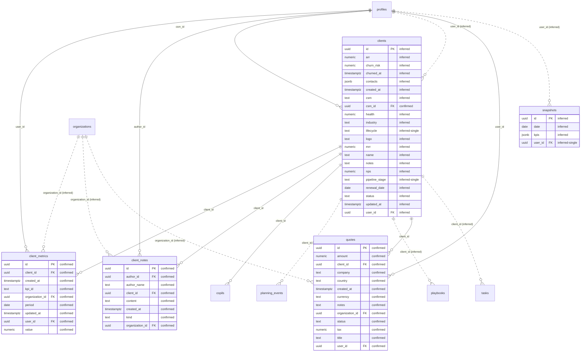

**RLS in the repo:** `clients` (5 policies), `client_notes` (3 policies), `client_metrics` (4 policies), `quotes` (4 policies).

---

## 5. Work and delivery

`tasks`, `projects`, `planning_events`, `playbooks`, `roadmaps`, `copils`. 1 confirmed relationship, 10 inferred.

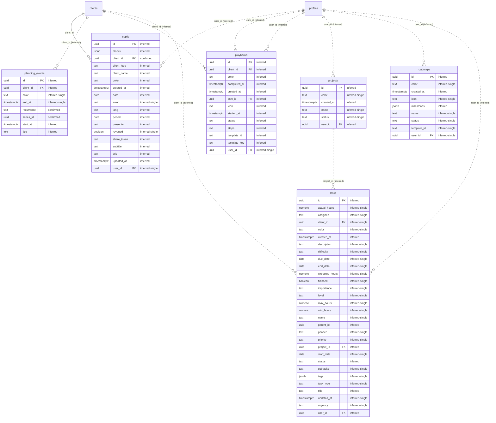

---

## 6. Oxygen (well-being)

`oxygen_checkins`, `oxygen_daily`, `oxygen_recoveries`. 0 confirmed relationships, 3 inferred.

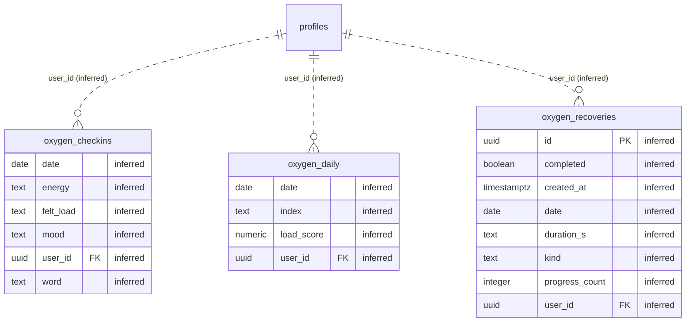

---

## 7. Chat

`chat_channels`, `chat_messages`, `chat_channel_members`. 6 confirmed relationships, 2 inferred.

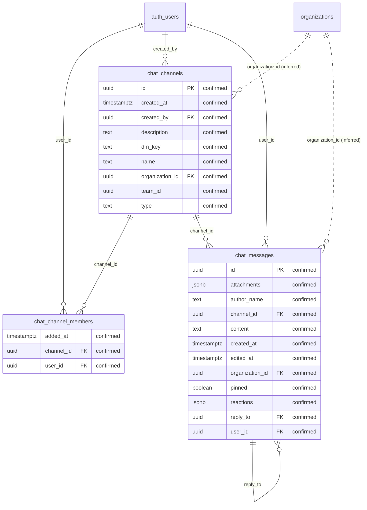

**RLS in the repo:** `chat_channels` (11 policies), `chat_messages` (11 policies), `chat_channel_members` (1 policies).

---

## 8. Email

`email_templates`, `sent_emails`, `org_email_config`. 1 confirmed relationship, 4 inferred.

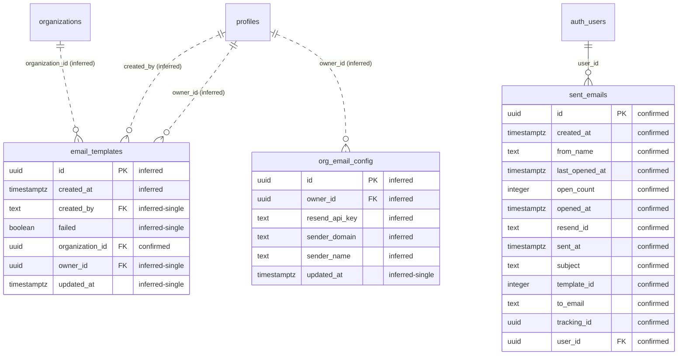

**RLS in the repo:** `email_templates` (4 policies), `sent_emails` (3 policies).

---

## 9. AI assistants

`ai_conversations`, `ai_messages`. 0 confirmed relationships, 2 inferred.

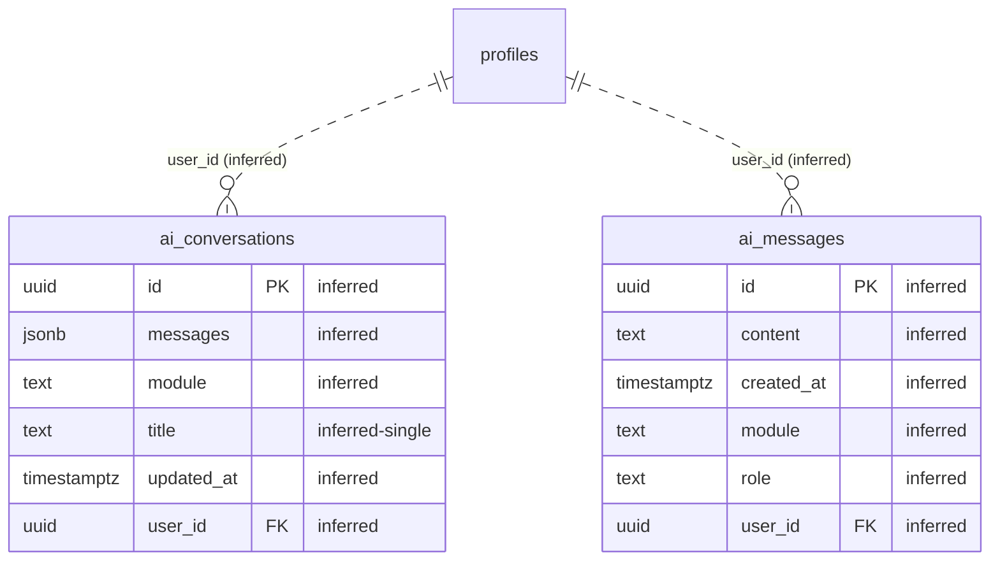

---

## 10. Integrations (dormant)

`org_integrations`, `api_keys`, `webhooks`, `team_members`. 0 confirmed relationships, 4 inferred.

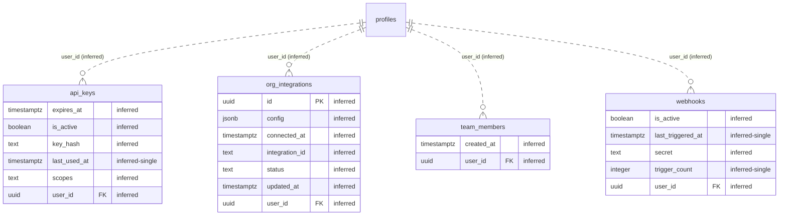

---

## 11. Notifications

`notifications`. 0 confirmed relationships, 0 inferred.

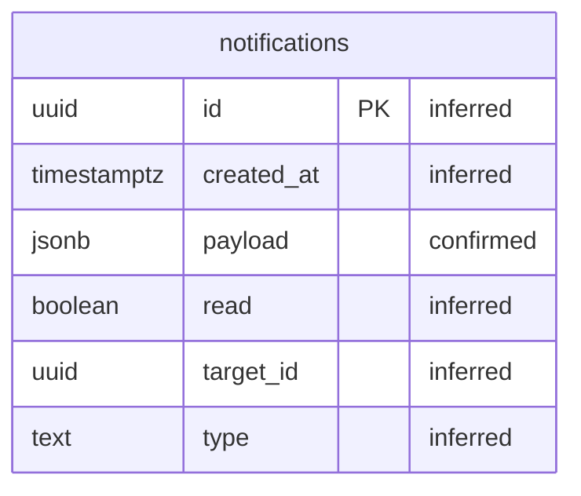

---

## 12. Relationship reference

### 12.1 Confirmed foreign keys

Every one has a `REFERENCES` clause in the SQL. These are the only relationships this repository proves.

| From | Column | References | On delete | Declared in |
|---|---|---|---|---|
| `chat_channel_members` | `channel_id` | `chat_channels` | cascade | `20260713160000_chat_dm.sql` |
| `chat_channel_members` | `user_id` | `auth.users` | cascade | `20260713160000_chat_dm.sql` |
| `chat_channels` | `created_by` | `auth.users` | set null | `20260421_chat_tables.sql` |
| `chat_messages` | `channel_id` | `chat_channels` | cascade | `20260421_chat_tables.sql` |
| `chat_messages` | `reply_to` | `chat_messages` | set null | `20260421_chat_tables.sql` |
| `chat_messages` | `user_id` | `auth.users` | cascade | `20260421_chat_tables.sql` |
| `client_metrics` | `client_id` | `clients` | cascade | `20260722200000_client_metrics.sql` |
| `client_metrics` | `user_id` | `profiles` | set null | `20260722200000_client_metrics.sql` |
| `client_notes` | `author_id` | `profiles` | set null | `20260720233000_client_notes_and_org_write.sql` |
| `client_notes` | `client_id` | `clients` | cascade | `20260720233000_client_notes_and_org_write.sql` |
| `clients` | `csm_id` | `profiles` | set null | `20260718200000_clients_csm_id.sql` |
| `copils` | `client_id` | `clients` | set null | `20260706220000_copils_client_id.sql` |
| `quotes` | `client_id` | `clients` | set null | `20260720240000_quotes_table.sql` |
| `quotes` | `user_id` | `profiles` | set null | `20260720240000_quotes_table.sql` |
| `sent_emails` | `user_id` | `auth.users` | cascade | `20260419_sent_emails.sql` |
| `user_profiles` | `id` | `auth.users` | cascade | `001_user_profiles.sql` |

### 12.2 Inferred relationships

A `*_id` column whose name matches an existing table. **No `REFERENCES` clause proves any of these.** They are shown dashed throughout, and each should be confirmed against the live database before being relied on.

| From | Column | Probable target |
|---|---|---|
| `activity_log` | `organization_id` | `organizations` |
| `activity_log` | `user_id` | `profiles` |
| `ai_conversations` | `user_id` | `profiles` |
| `ai_messages` | `user_id` | `profiles` |
| `api_keys` | `user_id` | `profiles` |
| `chat_channels` | `organization_id` | `organizations` |
| `chat_messages` | `organization_id` | `organizations` |
| `client_metrics` | `organization_id` | `organizations` |
| `client_notes` | `organization_id` | `organizations` |
| `clients` | `user_id` | `profiles` |
| `copils` | `user_id` | `profiles` |
| `email_templates` | `created_by` | `profiles` |
| `email_templates` | `organization_id` | `organizations` |
| `email_templates` | `owner_id` | `profiles` |
| `invitations` | `invited_by` | `profiles` |
| `invitations` | `organization_id` | `organizations` |
| `org_email_config` | `owner_id` | `profiles` |
| `org_integrations` | `user_id` | `profiles` |
| `organization_members` | `organization_id` | `organizations` |
| `organization_members` | `user_id` | `profiles` |
| `organizations` | `owner_id` | `profiles` |
| `oxygen_checkins` | `user_id` | `profiles` |
| `oxygen_daily` | `user_id` | `profiles` |
| `oxygen_recoveries` | `user_id` | `profiles` |
| `planning_events` | `client_id` | `clients` |
| `playbooks` | `client_id` | `clients` |
| `playbooks` | `csm_id` | `profiles` |
| `playbooks` | `user_id` | `profiles` |
| `profiles` | `organization_id` | `organizations` |
| `projects` | `user_id` | `profiles` |
| `promo_codes` | `organization_id` | `organizations` |
| `quotes` | `organization_id` | `organizations` |
| `roadmaps` | `user_id` | `profiles` |
| `snapshots` | `user_id` | `profiles` |
| `tasks` | `client_id` | `clients` |
| `tasks` | `project_id` | `projects` |
| `tasks` | `user_id` | `profiles` |
| `team_members` | `user_id` | `profiles` |
| `webhooks` | `user_id` | `profiles` |

### 12.3 Key-shaped columns that are *not* keys

These end in `_id` but reference nothing. They are excluded from every diagram above.

| Column | Why it is not a foreign key |
|---|---|
| `stripe_customer_id`, `stripe_subscription_id` | Stripe identifiers — `cus_…` / `sub_…` strings |
| `template_id` | Slug naming a template in application config, not a row |
| `kpi_id` | Slug from `config/kpis.js` |
| `entity_id` | Polymorphic — `activity_log` stores `entity_type` beside it |
| `integration_id` | Provider slug (`hubspot`, `salesforce`) |
| `series_id` | Groups recurring `planning_events` rows; references no parent table |
| `resend_id`, `tracking_id`, `share_token`, `dm_key` | External or generated identifiers |

---

## 13. Limits

- **Cardinality is not proven.** Every relationship is drawn one-to-many because that is what a single `*_id` column implies. Uniqueness constraints that would make one one-to-one are not recoverable from code.
- **Only 16 of 55 relationships are confirmed.** The other 39 are name-matching.
- **Tables may have columns not shown.** Diagrams reflect what the code touches; a column no code path reads is invisible here.
- **`auth.users` is external.** It belongs to the Supabase auth schema and is drawn only where something references it.

Run `supabase db dump --schema public` to replace every dashed line and inferred type with fact.

