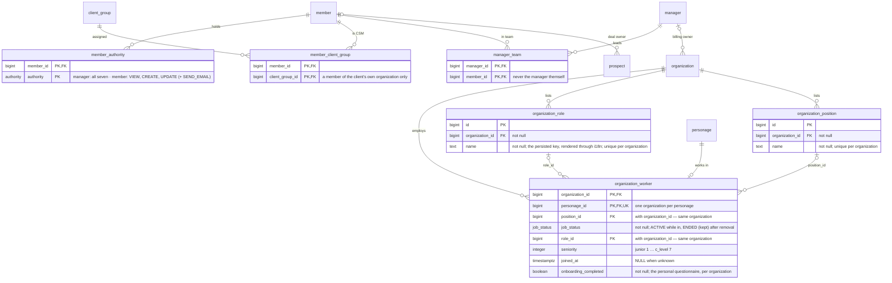
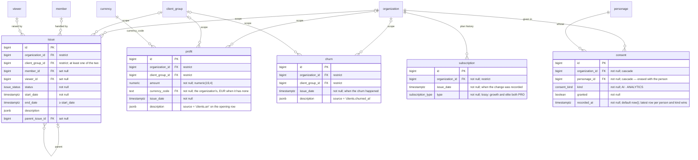
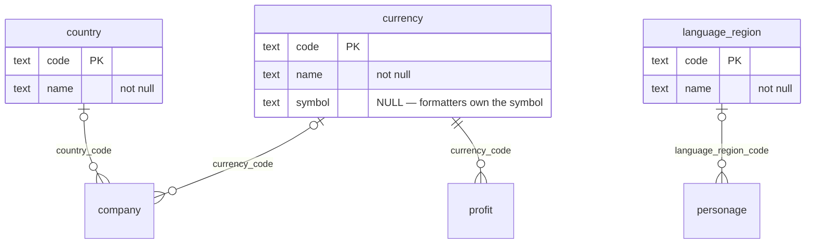
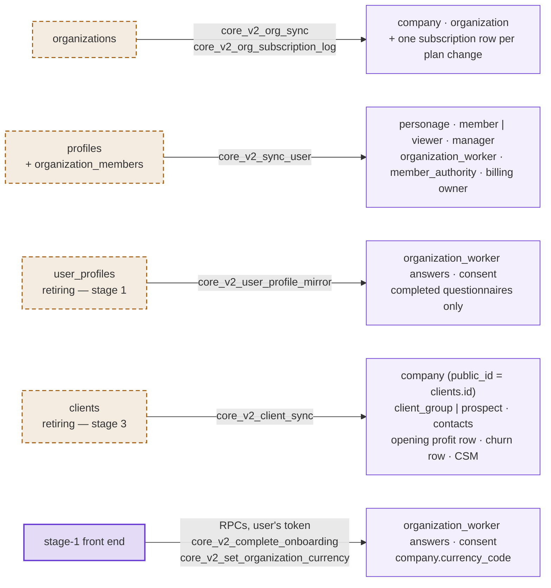
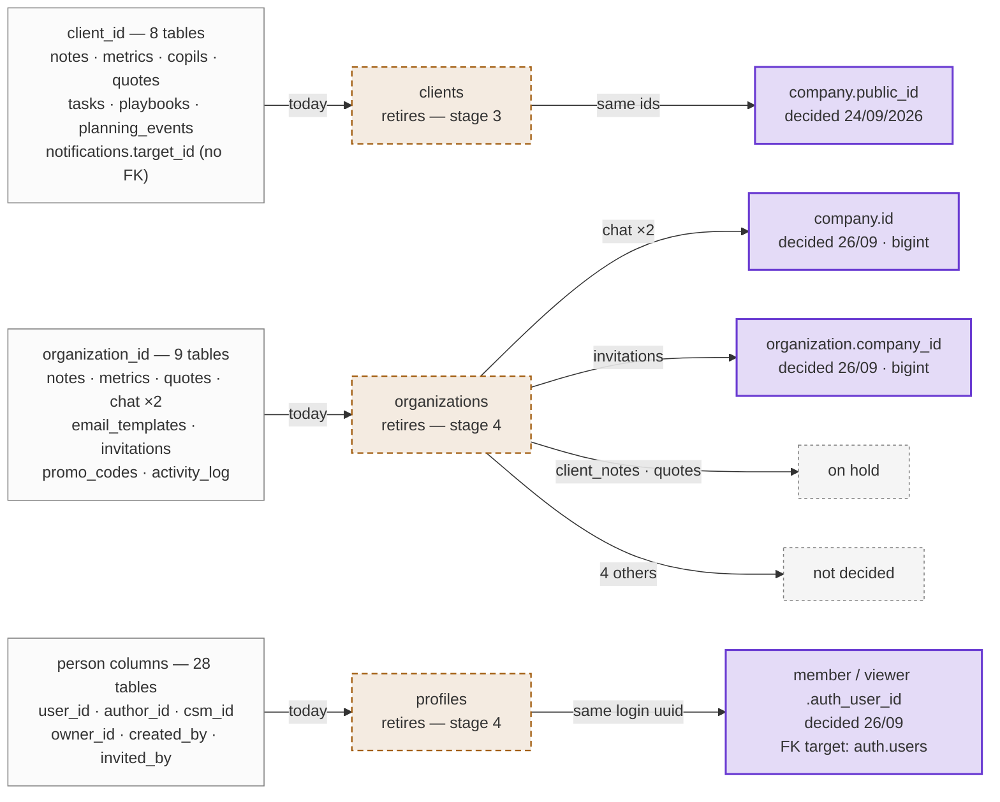
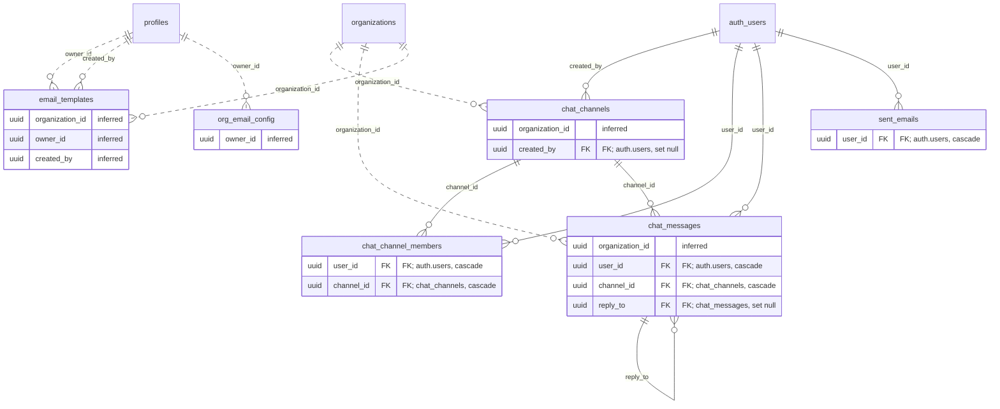

# core_v2 database diagram

**Generated** 26 September 2026 from the migrations as they stand in the working tree:
`supabase/migrations/20260920100000_core_v2_schema.sql`, `…110000_core_v2_sync_triggers.sql`,
`…120000_core_v2_backfill.sql` and `20260924100000_core_v2_stage1_user_profiles.sql` — stage 1
(`user_profiles`) and stage 3a (`clients`) included. **26 tables, 42 foreign keys, 8 enums** —
plus, in §8, the 30 old tables that stay and where their references land.

> **Not applied to any Supabase project yet.** Tested on a local PostgreSQL 16 with Supabase stand-ins
> (196 assertions). The old schema is drawn in [DATABASE_DIAGRAM.md](DATABASE_DIAGRAM.md) (7 September 2026);
> the decisions behind this one are in [DATABASE.md](DATABASE.md#core_v2--the-new-core-schema-additive).
> Maintained by hand: update it in the same change as any core_v2 migration — a stale diagram is worse than none.

## How to read these diagrams

| Notation | Meaning |
|---|---|
| `A \|\|--o\| B` | one A, zero or one B — B *is a* A, or a unique link |
| `A \|\|--o{ B` | one A, zero or many B |
| `A \|o--o{ B` | zero or one A (the foreign key is nullable), zero or many B |
| `PK` / `FK` / `UK` | primary key / foreign key / unique |
| comment | `not null`, the exact type when shortened, and what the column holds |

Each table's columns appear once, in the diagram of its own group; other diagrams show it by name only.

## 1. Identity — companies and people

Every account is a `company`, every human a `personage`. `organization`, `client_group` and `prospect`
hang off `company`; `member` and `viewer` off `personage`. A prospect and the client group it becomes
share one company, so notes and contacts follow the account. A contact is a viewer linked to a company.

```mermaid
erDiagram
  company {
    bigint id PK "identity"
    uuid public_id UK "not null; the old clients.id for a mirrored client; URLs and the 7 client_id tables keep it"
    text name "not null"
    text country_code FK "NULL — organizations has no country"
    text currency_code FK "the organization's currency; a manager changes it"
    text photo_path "← clients.logo"
  }
  organization {
    bigint company_id PK, FK "cascade"
    bigint owner_personage_id FK "the billing owner; set null"
  }
  client_group {
    bigint company_id PK, FK "cascade"
    client_status status "not null; ACTIVE · INACTIVE · CHURNED"
    text industry
    text notes
    numeric health "/10 — lib/health is the only scale"
    numeric nps
    numeric churn_risk
    text health_status "the manual flag ← clients.status (critical / watch / todo)"
    date renewal_date
    timestamptz created_at "NULL when unknown"
  }
  prospect {
    bigint id PK
    bigint organization_id FK "not null; the seller; cascade"
    bigint company_id FK, UK "not null; won = a client_group appears on this same company"
    text industry
    text notes
    pipeline_stage pipeline_stage "not null; default NEW"
    bigint member_id FK "the deal owner (clients.csm_id); set null"
  }
  organization_client_group {
    bigint organization_id PK, FK
    bigint client_group_id PK, FK, UK "exactly one organization per client group"
  }
  company_link {
    bigint id PK
    bigint company_id FK "not null"
    text url "not null; unique per company"
    integer sort_order "not null; default 0"
  }
  personage {
    bigint id PK
    text first_name "not null; a contact's whole name — never split"
    text last_name "not null; '' for a contact"
    person_title title
    text language_region_code FK "fr · en · ko, else NULL"
    text phone_number
    text email_address
    text photo_path
  }
  member {
    bigint personage_id PK, FK
    uuid auth_user_id UK "the login — no FK to auth.users, on purpose"
  }
  manager {
    bigint personage_id PK, FK
  }
  viewer {
    bigint personage_id PK, FK
    uuid auth_user_id UK "NULL for a contact"
  }
  client_group_viewer {
    bigint client_group_id PK, FK "a COMPANY, so a prospect's contacts are kept"
    bigint viewer_id PK, FK
    text role "what the contact is for this client"
    boolean is_primary "not null; default false; one per company"
  }
  personage_link {
    bigint id PK
    bigint personage_id FK "not null"
    text url "not null; unique per person"
    integer sort_order "not null; default 0"
  }
  company ||--o| organization : "is a"
  company ||--o| client_group : "is a"
  company ||--o| prospect : "sold as"
  organization ||--o{ prospect : "sells"
  organization ||--o{ organization_client_group : "owns"
  client_group ||--o| organization_client_group : "belongs via"
  company ||--o{ company_link : "has"
  personage ||--o| member : "is a"
  personage ||--o| viewer : "is a"
  member ||--o| manager : "is a"
  personage ||--o{ personage_link : "has"
  company ||--o{ client_group_viewer : "has contact"
  viewer ||--o{ client_group_viewer : "is contact"
  organization ||--o{ organization_worker : "employs"
  personage ||--o| organization_worker : "works in"
```

## 2. Work and access

Authorities and assignments key on `member`; the job itself (role, position, seniority, questionnaire)
is on `organization_worker`, whose `role_id` / `position_id` are composite keys with `organization_id`.

## 3. Records

Attached to an organization, a client group, or both (if both, the client group must belong to that
organization — a trigger checks it). ARR is computed from `profit`, never stored.

## 4. Reference data

Seeded lookup tables — foreign-key targets, never rendered (names come from `Intl` and i18n).

## 5. Where the data comes from today

Until each old table is retired it stays the source of truth: four fail-open triggers copy every write
into core_v2. The stage-1 front end is the only code that writes core_v2 directly.

## 6. Enums

| Enum | Values |
|---|---|
| `authority` | VIEW · CREATE · UPDATE · DELETE · INVITE · SEND_EMAIL · ASSIGN_CLIENT_GROUP |
| `job_status` | ACTIVE · INACTIVE · ON_LEAVE · ENDED |
| `client_status` | ACTIVE · INACTIVE · CHURNED |
| `pipeline_stage` | NEW · CONTACTED · QUALIFIED · WON · LOST |
| `issue_status` | OPEN · IN_PROGRESS · RESOLVED · CLOSED |
| `subscription_type` | FREE · BASIC · PRO · ENTERPRISE — tiers still undecided |
| `consent_kind` | AI · ANALYTICS |
| `person_title` | MR · MS · MRS · DR · MX |

## 7. Decision tags

Each tag is grep-able in the SQL, next to the code it explains.

| Tag | What it decides |
|---|---|
| `CORE-V2-PUBLIC-ID` | `company.public_id` is the old `clients.id`; a prospect and its client group share one company. |
| `CORE-V2-CONTACTS` | `client_group_viewer` points at `company` and carries `role` / `is_primary`; prospects keep their contacts. |
| `CORE-V2-CLIENT-HEALTH` | `health`, `nps`, `churn_risk`, `health_status`, `renewal_date`, `created_at` on `client_group` (kept 24/09/2026). |
| `CORE-V2-ARR-PROFIT` | ARR = a client group's `profit` rows dated in the last 12 months; MRR = ARR ÷ 12; one opening row from `clients.arr`. |
| `CORE-V2-CONSENT` | `consent` is append-only; the latest row per person and kind is the current state. |
| `CORE-V2-PLAN-HOME` | The plan tier is never a column of `organization` or `organization_worker`. |
| `CORE-V2-AUTH-LINK` | `member` / `viewer.auth_user_id` link a login, with no foreign key to `auth.users`, on purpose. |
| `CORE-V2-AUTHORITY` | The `authority` enum adds `INVITE`, `SEND_EMAIL`, `ASSIGN_CLIENT_GROUP` to the four verbs. |
| `CORE-V2-COLUMNS` | Columns the source DDL had no home for: `organization_role`, worker role / seniority / `joined_at` / `onboarding_completed`, client_group `industry` / `notes`, `prospect`. |
| `CORE-V2-CG-ORG` | A client group's organization is `organization_client_group`, unique on `client_group_id`. |
| `CORE-V2-OWNER` | `organization.owner_personage_id` records the billing owner. |
| `CORE-V2-COUNTRY` | `company.country_code` / `currency_code` are nullable — no invented value. |

## 8. Old tables that stay

**30 old tables have no core_v2 counterpart and are not retired** — every old table except the five
core ones (`organizations`, `profiles`, `organization_members`, `clients`, `user_profiles`). They point at
those five, so each reference has to land somewhere when its target is dropped. Sources:
[SCHEMA_FROM_CODE.sql](SCHEMA_FROM_CODE.sql) and [DATABASE_DIAGRAM.md](DATABASE_DIAGRAM.md) §12, checked
against the code for `planning_events.user_id` and `notifications.user_id` / `target_id`.

### 8.1 Where their references land

All five old core tables go — `clients`, `organizations`, `profiles`, `organization_members` and
`user_profiles` (confirmed 26/09/2026).

- **Client ids** (8 tables) keep their values: `company.public_id` is the old `clients.id`, so the
  foreign keys move and nothing is rewritten — the `/app/clients/<id>` routes in `notifications` included.
  Repointed in stage 3c.
- **Person columns** (28 tables) keep their values — they are login uuids — and a person is found
  through `member.auth_user_id` / `viewer.auth_user_id` (decided 26/09/2026). The foreign key goes to
  `auth.users`, the id space of both: one column cannot reference two tables, and a member → viewer change
  deletes the `member` row, which would cascade to (or block on) everything that person wrote.
- **Organization ids** (9 tables) are decided per table (26/09/2026). `organization` has no `id` column:
  its key is `company_id`, the same number as its `company.id`, so "organization.id" is an FK to
  `organization(company_id)`. Both decided targets are bigint, so those columns change type from uuid and
  every row is rewritten; `company.id` also admits a client company, `organization(company_id)` only an
  organization.

| Table | `organization_id` goes to |
|---|---|
| `chat_channels` | `company.id` — decided 26/09/2026 |
| `chat_messages` | `company.id` — decided 26/09/2026 |
| `invitations` | `organization.company_id` — decided 26/09/2026 |
| `client_notes` | on hold |
| `quotes` | on hold |
| `client_metrics` | not decided |
| `email_templates` | not decided |
| `promo_codes` | not decided |
| `activity_log` | not decided |

### 8.2 Client work

```mermaid
erDiagram
  client_notes {
    uuid client_id FK "FK; clients, cascade"
    uuid organization_id "inferred"
    uuid author_id FK "FK; profiles, set null"
  }
  client_metrics {
    uuid client_id FK "FK; clients, cascade"
    uuid organization_id "inferred"
    uuid user_id FK "FK; profiles, set null"
  }
  copils {
    uuid client_id FK "FK; clients, set null"
    uuid user_id "inferred"
  }
  quotes {
    uuid client_id FK "FK; clients, set null"
    uuid organization_id "inferred"
    uuid user_id FK "FK; profiles, set null"
  }
  tasks {
    uuid client_id "inferred"
    uuid user_id "inferred"
    uuid project_id "inferred; projects"
  }
  playbooks {
    uuid client_id "inferred"
    uuid user_id "inferred"
    uuid csm_id "inferred"
  }
  planning_events {
    uuid client_id "inferred"
    uuid user_id "in code; NOT NULL, RLS auth.uid()"
  }
  projects {
    uuid user_id "inferred"
  }
  roadmaps {
    uuid user_id "inferred"
  }
  snapshots {
    uuid user_id "inferred"
  }
  clients ||--o{ client_notes : "client_id"
  organizations ||..o{ client_notes : "organization_id"
  profiles ||--o{ client_notes : "author_id"
  clients ||--o{ client_metrics : "client_id"
  organizations ||..o{ client_metrics : "organization_id"
  profiles ||--o{ client_metrics : "user_id"
  clients ||--o{ copils : "client_id"
  profiles ||..o{ copils : "user_id"
  clients ||--o{ quotes : "client_id"
  organizations ||..o{ quotes : "organization_id"
  profiles ||--o{ quotes : "user_id"
  clients ||..o{ tasks : "client_id"
  profiles ||..o{ tasks : "user_id"
  projects ||..o{ tasks : "project_id"
  clients ||..o{ playbooks : "client_id"
  profiles ||..o{ playbooks : "user_id"
  profiles ||..o{ playbooks : "csm_id"
  clients ||..o{ planning_events : "client_id"
  profiles ||..o{ planning_events : "user_id"
  profiles ||..o{ projects : "user_id"
  profiles ||..o{ roadmaps : "user_id"
  profiles ||..o{ snapshots : "user_id"
```

### 8.3 Team chat and email

### 8.4 Per-user and organization tables

```mermaid
erDiagram
  ai_conversations {
    uuid user_id "inferred"
  }
  ai_messages {
    uuid user_id "inferred"
  }
  oxygen_checkins {
    uuid user_id "inferred"
  }
  oxygen_daily {
    uuid user_id "inferred"
  }
  oxygen_recoveries {
    uuid user_id "inferred"
  }
  invitations {
    uuid organization_id "inferred"
    uuid invited_by "inferred"
  }
  promo_codes {
    uuid organization_id "inferred"
  }
  activity_log {
    uuid organization_id "inferred"
    uuid user_id "inferred"
  }
  notifications {
    uuid target_id "a client id; no FK; also in route /app/clients/id"
    uuid user_id "in code; the recipient"
  }
  org_integrations {
    uuid user_id "inferred"
  }
  api_keys {
    uuid user_id "inferred"
  }
  webhooks {
    uuid user_id "inferred"
  }
  team_members {
    uuid user_id "inferred"
  }
  alpha_feedback {
    text none "no link column written"
  }
  profiles ||..o{ ai_conversations : "user_id"
  profiles ||..o{ ai_messages : "user_id"
  profiles ||..o{ oxygen_checkins : "user_id"
  profiles ||..o{ oxygen_daily : "user_id"
  profiles ||..o{ oxygen_recoveries : "user_id"
  organizations ||..o{ invitations : "organization_id"
  profiles ||..o{ invitations : "invited_by"
  organizations ||..o{ promo_codes : "organization_id"
  organizations ||..o{ activity_log : "organization_id"
  profiles ||..o{ activity_log : "user_id"
  clients ||..o{ notifications : "target_id"
  profiles ||..o{ notifications : "user_id"
  profiles ||..o{ org_integrations : "user_id"
  profiles ||..o{ api_keys : "user_id"
  profiles ||..o{ webhooks : "user_id"
  profiles ||..o{ team_members : "user_id"
```

In these three diagrams a **solid** line is a declared foreign key and a **dotted** line is inferred from the
column name only; `auth_users` is Supabase's `auth.users`. Only link columns are drawn — the other columns
are in [SCHEMA_FROM_CODE.sql](SCHEMA_FROM_CODE.sql).

### 8.5 Table by table

| Table | Module | Client | Organization | Person | Within its module |
|---|---|---|---|---|---|
| `client_notes` | Client work | `client_id` (FK → clients, cascade) | `organization_id` (inferred) *on hold* | `author_id` (FK → profiles, set null) | — |
| `client_metrics` | Client work | `client_id` (FK → clients, cascade) | `organization_id` (inferred) *not decided* | `user_id` (FK → profiles, set null) | — |
| `copils` | Client work | `client_id` (FK → clients, set null) | — | `user_id` (inferred) | — |
| `quotes` | Client work | `client_id` (FK → clients, set null) | `organization_id` (inferred) *on hold* | `user_id` (FK → profiles, set null) | — |
| `tasks` | Client work | `client_id` (inferred) | — | `user_id` (inferred) | `project_id` (inferred — projects) |
| `playbooks` | Client work | `client_id` (inferred) | — | `user_id` (inferred) `csm_id` (inferred) | — |
| `planning_events` | Client work | `client_id` (inferred) | — | `user_id` (in code — NOT NULL, RLS auth.uid()) | — |
| `projects` | Client work | — | — | `user_id` (inferred) | — |
| `roadmaps` | Client work | — | — | `user_id` (inferred) | — |
| `snapshots` | Client work | — | — | `user_id` (inferred) | — |
| `chat_channels` | Team chat | — | `organization_id` (inferred) **→ `company.id`** | `created_by` (FK → auth.users, set null) | — |
| `chat_channel_members` | Team chat | — | — | `user_id` (FK → auth.users, cascade) | `channel_id` (FK → chat_channels, cascade) |
| `chat_messages` | Team chat | — | `organization_id` (inferred) **→ `company.id`** | `user_id` (FK → auth.users, cascade) | `channel_id` (FK → chat_channels, cascade) `reply_to` (FK → chat_messages, set null) |
| `email_templates` | Email | — | `organization_id` (inferred) *not decided* | `owner_id` (inferred) `created_by` (inferred) | — |
| `sent_emails` | Email | — | — | `user_id` (FK → auth.users, cascade) | — |
| `org_email_config` | Email | — | — | `owner_id` (inferred) | — |
| `ai_conversations` | AI assistants | — | — | `user_id` (inferred) | — |
| `ai_messages` | AI assistants | — | — | `user_id` (inferred) | — |
| `oxygen_checkins` | Oxygen | — | — | `user_id` (inferred) | — |
| `oxygen_daily` | Oxygen | — | — | `user_id` (inferred) | — |
| `oxygen_recoveries` | Oxygen | — | — | `user_id` (inferred) | — |
| `invitations` | Team and access | — | `organization_id` (inferred) **→ `organization.company_id`** | `invited_by` (inferred) | — |
| `promo_codes` | Team and access | — | `organization_id` (inferred) *not decided* | — | — |
| `activity_log` | Team and access | — | `organization_id` (inferred) *not decided* | `user_id` (inferred) | — |
| `notifications` | Notifications | `target_id` (in code — a client id, no FK; also in route /app/clients/<id>) | — | `user_id` (in code — the recipient) | — |
| `org_integrations` | Integrations (dormant) | — | — | `user_id` (inferred) | — |
| `api_keys` | Integrations (dormant) | — | — | `user_id` (inferred) | — |
| `webhooks` | Integrations (dormant) | — | — | `user_id` (inferred) | — |
| `team_members` | Integrations (dormant) | — | — | `user_id` (inferred) | — |
| `alpha_feedback` | Feedback | — | — | — | — |
